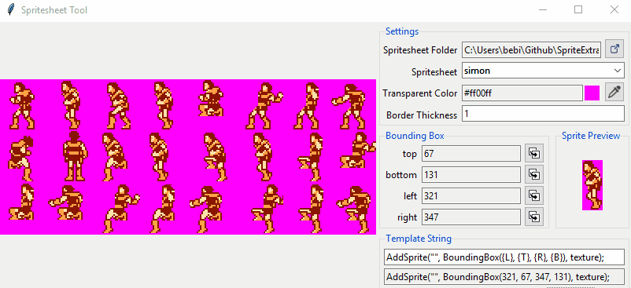

# Sprite Extractor

A small program to quickly get sprite's bounding box (left, top, right, bottom position) in the spritesheet



## Download

You can either download [here] or build from source

## Build from source

* Install [pyinstaller](https://www.pyinstaller.org/)
* Open your terminal and execute the following commands
```
git clone https://github.com/NearHuscarl/SpriteExtractor
cd SpriteExtractor
pyinstaller build.spec
```
* After that, a new application will be created in the dist/ folder

[here]: https://github.com/NearHuscarl/SpriteExtractor/releases/tag/1.0.0